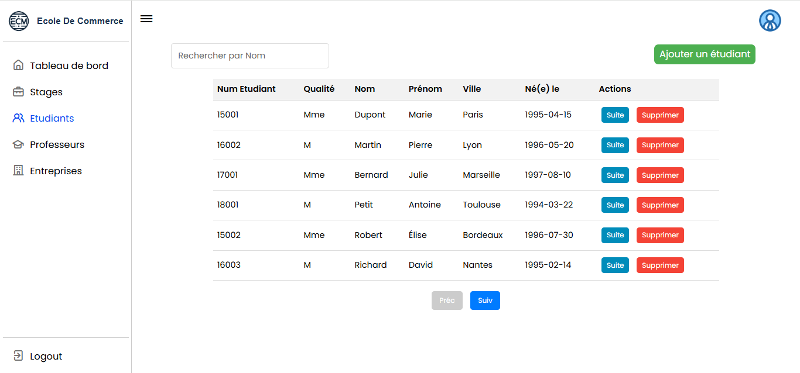

# Application de Gestion des Stages - École de Commerce
> Système de gestion des stages développé avec Spring Boot & Thymeleaf

## Description du Projet
Application web développée dans le cadre du projet SI, permettant la gestion complète du processus de stages pour une école de commerce. Le système offre une interface intuitive pour gérer les étudiants, les professeurs, les entreprises et leurs stages respectifs.

## 🛠 Stack Technique

### Backend
- **Spring Boot** - Framework Java pour le développement d'applications
- **PostgreSQL** - Système de gestion de base de données
- **Spring Data JPA** - Couche d'accès aux données
- **Thymeleaf** - Moteur de template côté serveur

### Frontend
- **Bootstrap** - Framework CSS pour le design responsive
- **JavaScript** - Interactions côté client
- **HTML5/CSS3** - Structure et style

## 🚀 Fonctionnalités Clés

### Dashboard

- Vue d'ensemble statistique
- Suivi des activités récentes
- Interface administrateur intuitive

### Gestion des Données

- CRUD complet pour tous les acteurs (Étudiants, Professeurs, Entreprises, Stages)
- Système de recherche intégré
- Actions rapides
- Interface responsive

